# 🏗️ Plan de Mejora de Arquitectura - AirbnBOT

## 📋 Tabla de Contenidos

1. [Análisis de la Arquitectura Actual](#-análisis-de-la-arquitectura-actual)
2. [Problemas Identificados](#-problemas-identificados)
3. [Arquitectura Propuesta](#-arquitectura-propuesta)
4. [Plan de Migración](#-plan-de-migración)
5. [Beneficios Esperados](#-beneficios-esperados)
6. [Cronograma de Implementación](#-cronograma-de-implementación)
7. [Consideraciones Técnicas](#-consideraciones-técnicas)
8. [Riesgos y Mitigación](#-riesgos-y-mitigación)

---

## 🔍 Análisis de la Arquitectura Actual

### Estado Actual del Sistema


### Fortalezas Actuales

✅ **Funcionalidad Completa**: El sistema funciona y cumple sus objetivos  
✅ **Arquitectura Híbrida**: Separación entre monitor y procesadores  
✅ **Dashboard Funcional**: Interfaz web operativa  
✅ **Integración IA**: OpenAI integrado correctamente  
✅ **Notificaciones**: Sistema Telegram funcionando  

### Limitaciones Identificadas

❌ **Escalabilidad Limitada**: Procesos hijo no escalables  
❌ **Almacenamiento Frágil**: JSON files como única persistencia  
❌ **Monitoreo Básico**: Falta observabilidad avanzada  
❌ **Recuperación Manual**: Sin auto-recovery ante fallos  
❌ **Configuración Estática**: Parámetros hardcodeados  
❌ **Testing Limitado**: Falta suite de pruebas  

---

## ⚠️ Problemas Identificados

### 1. **Problemas de Escalabilidad**

#### Arquitectura de Procesos
```javascript
// Problema actual: Gestión manual de procesos hijo
const child = spawn('node', [CHECK_NEW_MESSAGES_SCRIPT, chatUrl]);
activeChildProcesses.set(threadId, child);
```

**Limitaciones:**
- No hay límite en el número de procesos hijo
- Gestión de memoria no optimizada
- Falta pool de workers reutilizables

#### Almacenamiento de Datos
```javascript
// Problema: Escritura síncrona de archivos JSON
fs.writeFileSync(threadStatePath, JSON.stringify(states, null, 2));
```

**Limitaciones:**
- Bloqueo de I/O en escrituras
- Riesgo de corrupción de datos
- No hay transacciones atómicas
- Falta backup automático

### 2. **Problemas de Confiabilidad**

#### Gestión de Errores
```javascript
// Problema: Manejo básico de errores
catch (error) {
    console.error('❌ Error:', error.message);
    // Sin recovery automático
}
```

#### Dependencias Externas
- **Puppeteer**: Vulnerable a cambios en Airbnb
- **OpenAI**: Sin fallback ante rate limits
- **Telegram**: Sin retry automático

### 3. **Problemas de Mantenibilidad**

#### Configuración Hardcodeada
```javascript
// Problema: Valores fijos en código
const CHECK_INTERVAL = 15000;
const MAX_IDLE_TIME = 5 * 60 * 1000;
```

#### Monitoreo Limitado
- Logs básicos sin estructura
- Falta métricas de rendimiento
- Sin alertas automáticas

---

## 🚀 Arquitectura Propuesta

### Visión de la Nueva Arquitectura


### Componentes de la Nueva Arquitectura

#### 1. **API Gateway**
```typescript
// Nuevo: Gateway centralizado
interface APIGateway {
  rateLimit: RateLimitConfig;
  authentication: AuthConfig;
  routing: RouteConfig[];
  monitoring: MetricsConfig;
}
```

#### 2. **Microservicios Especializados**

##### Dashboard Service
```typescript
interface DashboardService {
  routes: {
    property: PropertyController;
    qa: QAController;
    analytics: AnalyticsController;
    auth: AuthController;
  };
  database: PostgreSQLConnection;
  cache: RedisConnection;
}
```

##### Bot Manager Service
```typescript
interface BotManagerService {
  monitor: AirbnbMonitor;
  queue: MessageQueue;
  scheduler: TaskScheduler;
  healthCheck: HealthMonitor;
}
```

##### Message Processor Service
```typescript
interface MessageProcessorService {
  workerPool: WorkerPool<MessageWorker>;
  aiService: AIServiceClient;
  notificationService: NotificationServiceClient;
  stateManager: ConversationStateManager;
}
```

#### 3. **Sistema de Colas**
```typescript
interface MessageQueue {
  producer: QueueProducer;
  consumer: QueueConsumer;
  deadLetterQueue: DLQHandler;
  retryPolicy: RetryConfig;
}
```

#### 4. **Base de Datos Distribuida**

##### PostgreSQL Schema
```sql
-- Conversaciones
CREATE TABLE conversations (
    id UUID PRIMARY KEY,
    thread_id VARCHAR(255) UNIQUE,
    guest_name VARCHAR(255),
    status conversation_status,
    created_at TIMESTAMP,
    updated_at TIMESTAMP
);

-- Mensajes
CREATE TABLE messages (
    id UUID PRIMARY KEY,
    conversation_id UUID REFERENCES conversations(id),
    content TEXT,
    sender message_sender,
    ai_processed BOOLEAN DEFAULT FALSE,
    created_at TIMESTAMP
);

-- Q&A Base de Conocimiento
CREATE TABLE knowledge_base (
    id UUID PRIMARY KEY,
    question TEXT,
    answer TEXT,
    category VARCHAR(100),
    usage_count INTEGER DEFAULT 0,
    effectiveness_score DECIMAL(3,2),
    created_at TIMESTAMP,
    updated_at TIMESTAMP
);

-- Métricas
CREATE TABLE metrics (
    id UUID PRIMARY KEY,
    metric_name VARCHAR(100),
    metric_value DECIMAL(10,2),
    tags JSONB,
    timestamp TIMESTAMP
);
```

##### Redis Cache Structure
```typescript
interface RedisStructure {
  sessions: `session:${userId}`;
  conversations: `conv:${threadId}`;
  aiCache: `ai:${messageHash}`;
  rateLimits: `rate:${clientId}`;
  config: `config:${service}`;
}
```

---

## 📋 Plan de Migración

### Fase 1: Preparación y Fundamentos (2-3 semanas)

#### Semana 1: Infraestructura Base
```bash
# 1. Configurar base de datos
docker-compose up -d postgres redis

# 2. Migrar datos existentes
npm run migrate:json-to-db

# 3. Configurar monitoreo básico
docker-compose up -d prometheus grafana
```

#### Semana 2: Refactoring Core
```typescript
// 1. Crear interfaces TypeScript
interface ConversationManager {
  createConversation(threadId: string): Promise<Conversation>;
  updateConversation(id: string, data: Partial<Conversation>): Promise<void>;
  getActiveConversations(): Promise<Conversation[]>;
}

// 2. Implementar repositorios
class PostgreSQLConversationRepository implements ConversationRepository {
  async create(conversation: CreateConversationDTO): Promise<Conversation> {
    // Implementación con transacciones
  }
}
```

#### Semana 3: Sistema de Colas
```typescript
// Implementar cola de mensajes
class MessageQueueService {
  async enqueueMessage(message: IncomingMessage): Promise<void> {
    await this.queue.add('process-message', message, {
      attempts: 3,
      backoff: 'exponential'
    });
  }
}
```

### Fase 2: Microservicios Core (3-4 semanas)

#### Semana 4-5: Dashboard Service
```typescript
// Nuevo Dashboard Service
@Controller('/api/dashboard')
export class DashboardController {
  constructor(
    private readonly propertyService: PropertyService,
    private readonly qaService: QAService,
    private readonly analyticsService: AnalyticsService
  ) {}

  @Get('/property')
  @UseGuards(AuthGuard)
  async getProperty(): Promise<PropertyDTO> {
    return this.propertyService.getProperty();
  }
}
```

#### Semana 6-7: Bot Manager Service
```typescript
// Nuevo Bot Manager
export class BotManagerService {
  private readonly monitor: AirbnbMonitor;
  private readonly queue: MessageQueue;

  async startMonitoring(): Promise<void> {
    const unreadMessages = await this.monitor.getUnreadMessages();
    
    for (const message of unreadMessages) {
      await this.queue.enqueueMessage({
        threadId: message.threadId,
        content: message.content,
        timestamp: message.timestamp
      });
    }
  }
}
```

### Fase 3: Procesamiento Avanzado (2-3 semanas)

#### Semana 8-9: Message Processor Service
```typescript
// Worker Pool para procesamiento
export class MessageWorkerPool {
  private workers: Worker[] = [];

  async processMessage(job: MessageJob): Promise<void> {
    const worker = await this.getAvailableWorker();
    
    try {
      const response = await worker.process(job);
      await this.handleResponse(response);
    } catch (error) {
      await this.handleError(error, job);
    }
  }
}
```

#### Semana 10: AI Service
```typescript
// Servicio de IA con fallbacks
export class AIService {
  private readonly providers: AIProvider[] = [
    new OpenAIProvider(),
    new AnthropicProvider(), // Fallback
    new LocalModelProvider() // Fallback local
  ];

  async generateResponse(context: ConversationContext): Promise<AIResponse> {
    for (const provider of this.providers) {
      try {
        return await provider.generateResponse(context);
      } catch (error) {
        console.warn(`Provider ${provider.name} failed, trying next...`);
      }
    }
    
    throw new Error('All AI providers failed');
  }
}
```

### Fase 4: Monitoreo y Optimización (2 semanas)

#### Semana 11: Observabilidad
```typescript
// Métricas personalizadas
@Injectable()
export class MetricsService {
  private readonly prometheus = new PrometheusService();

  recordMessageProcessed(success: boolean, duration: number): void {
    this.prometheus.incrementCounter('messages_processed_total', {
      status: success ? 'success' : 'error'
    });
    
    this.prometheus.recordHistogram('message_processing_duration_seconds', duration);
  }
}
```

#### Semana 12: Testing y Deployment
```typescript
// Tests de integración
describe('MessageProcessingFlow', () => {
  it('should process message end-to-end', async () => {
    const message = createTestMessage();
    await messageQueue.enqueue(message);
    
    const result = await waitForProcessing(message.id);
    expect(result.status).toBe('processed');
  });
});
```

---

## 🎯 Beneficios Esperados

### Mejoras en Rendimiento

#### Escalabilidad Horizontal
```yaml
# Kubernetes Deployment
apiVersion: apps/v1
kind: Deployment
metadata:
  name: message-processor
spec:
  replicas: 5  # Escalable según demanda
  selector:
    matchLabels:
      app: message-processor
```

**Métricas Esperadas:**
- **Throughput**: 10x más mensajes por minuto
- **Latencia**: Reducción del 60% en tiempo de respuesta
- **Concurrencia**: Soporte para 100+ conversaciones simultáneas

#### Optimización de Recursos
```typescript
// Pool de workers reutilizables
class WorkerPool {
  private readonly maxWorkers = 10;
  private readonly minWorkers = 2;
  
  async autoScale(): Promise<void> {
    const queueSize = await this.queue.getSize();
    const optimalWorkers = Math.min(
      Math.max(Math.ceil(queueSize / 10), this.minWorkers),
      this.maxWorkers
    );
    
    await this.adjustWorkerCount(optimalWorkers);
  }
}
```

### Mejoras en Confiabilidad

#### Sistema de Recuperación
```typescript
// Auto-recovery ante fallos
class HealthMonitor {
  async checkHealth(): Promise<HealthStatus> {
    const checks = await Promise.allSettled([
      this.checkDatabase(),
      this.checkQueue(),
      this.checkAIService(),
      this.checkAirbnbConnection()
    ]);
    
    return this.aggregateHealth(checks);
  }
  
  async handleUnhealthyService(service: string): Promise<void> {
    await this.restartService(service);
    await this.notifyAdministrators(service);
  }
}
```

#### Backup y Recuperación
```sql
-- Backup automático
CREATE OR REPLACE FUNCTION backup_conversations()
RETURNS void AS $$
BEGIN
  COPY conversations TO '/backups/conversations_' || 
    to_char(now(), 'YYYY-MM-DD_HH24-MI-SS') || '.csv' 
    WITH CSV HEADER;
END;
$$ LANGUAGE plpgsql;

-- Programar backup cada 6 horas
SELECT cron.schedule('backup-conversations', '0 */6 * * *', 'SELECT backup_conversations();');
```

### Mejoras en Observabilidad

#### Dashboard de Métricas
```typescript
// Métricas en tiempo real
interface SystemMetrics {
  messagesPerMinute: number;
  averageResponseTime: number;
  aiSuccessRate: number;
  activeConversations: number;
  queueDepth: number;
  errorRate: number;
}
```

#### Alertas Inteligentes
```yaml
# Prometheus Alerts
groups:
  - name: airbnbot.rules
    rules:
      - alert: HighErrorRate
        expr: rate(errors_total[5m]) > 0.1
        for: 2m
        annotations:
          summary: "High error rate detected"
          
      - alert: QueueBacklog
        expr: queue_depth > 100
        for: 5m
        annotations:
          summary: "Message queue backlog detected"
```

---

## 📅 Cronograma de Implementación

### Timeline Detallado


### Hitos Críticos

#### Hito 1: Base de Datos Migrada (Semana 3)
- ✅ Datos migrados de JSON a PostgreSQL
- ✅ Redis configurado para cache
- ✅ Backup automático funcionando

#### Hito 2: Microservicios Core (Semana 7)
- ✅ Dashboard Service desplegado
- ✅ Bot Manager Service operativo
- ✅ API Gateway configurado

#### Hito 3: Procesamiento Distribuido (Semana 10)
- ✅ Message Processor con worker pool
- ✅ AI Service con fallbacks
- ✅ Sistema de colas estable

#### Hito 4: Producción (Semana 12)
- ✅ Monitoreo completo
- ✅ Tests de integración pasando
- ✅ Deployment automatizado

---

## 🔧 Consideraciones Técnicas

### Tecnologías Recomendadas

#### Backend Stack
```json
{
  "runtime": "Node.js 20 LTS",
  "language": "TypeScript 5.x",
  "framework": "NestJS",
  "database": "PostgreSQL 15",
  "cache": "Redis 7",
  "queue": "BullMQ",
  "monitoring": "Prometheus + Grafana"
}
```

#### Infrastructure Stack
```yaml
# Docker Compose para desarrollo
version: '3.8'
services:
  postgres:
    image: postgres:15
    environment:
      POSTGRES_DB: airbnbot
      POSTGRES_USER: airbnbot
      POSTGRES_PASSWORD: ${DB_PASSWORD}
    volumes:
      - postgres_data:/var/lib/postgresql/data
      
  redis:
    image: redis:7-alpine
    command: redis-server --appendonly yes
    volumes:
      - redis_data:/data
      
  prometheus:
    image: prom/prometheus:latest
    ports:
      - "9090:9090"
    volumes:
      - ./prometheus.yml:/etc/prometheus/prometheus.yml
```

### Patrones de Diseño

#### Repository Pattern
```typescript
interface ConversationRepository {
  findById(id: string): Promise<Conversation | null>;
  findByThreadId(threadId: string): Promise<Conversation | null>;
  create(conversation: CreateConversationDTO): Promise<Conversation>;
  update(id: string, data: Partial<Conversation>): Promise<void>;
  delete(id: string): Promise<void>;
}
```

#### Command Query Responsibility Segregation (CQRS)
```typescript
// Commands (Write)
export class CreateConversationCommand {
  constructor(
    public readonly threadId: string,
    public readonly guestName: string
  ) {}
}

// Queries (Read)
export class GetActiveConversationsQuery {
  constructor(public readonly limit: number = 50) {}
}
```

#### Event Sourcing
```typescript
// Eventos del dominio
export class MessageReceivedEvent {
  constructor(
    public readonly conversationId: string,
    public readonly content: string,
    public readonly timestamp: Date
  ) {}
}

export class ResponseGeneratedEvent {
  constructor(
    public readonly conversationId: string,
    public readonly response: string,
    public readonly aiProvider: string
  ) {}
}
```

### Configuración Dinámica

#### Config Service
```typescript
@Injectable()
export class ConfigService {
  private config: ConfigSchema;
  
  async updateConfig(key: string, value: any): Promise<void> {
    await this.redis.set(`config:${key}`, JSON.stringify(value));
    this.config[key] = value;
    this.eventEmitter.emit('config.updated', { key, value });
  }
  
  get<T>(key: string): T {
    return this.config[key];
  }
}
```

#### Feature Flags
```typescript
@Injectable()
export class FeatureFlagService {
  async isEnabled(flag: string, context?: any): Promise<boolean> {
    const flagConfig = await this.getFlagConfig(flag);
    return this.evaluateFlag(flagConfig, context);
  }
}

// Uso en código
if (await this.featureFlags.isEnabled('advanced-ai-processing')) {
  return this.advancedAIService.process(message);
} else {
  return this.basicAIService.process(message);
}
```

---

## ⚠️ Riesgos y Mitigación

### Riesgos Técnicos

#### 1. **Complejidad de Migración**
**Riesgo**: Pérdida de datos durante la migración  
**Probabilidad**: Media  
**Impacto**: Alto  

**Mitigación**:
```bash
# Script de migración con rollback
#!/bin/bash
set -e

# Backup completo antes de migración
pg_dump airbnbot_old > backup_$(date +%Y%m%d_%H%M%S).sql

# Migración con verificación
npm run migrate:verify
npm run migrate:execute
npm run migrate:validate

# Rollback automático si falla
if [ $? -ne 0 ]; then
    echo "Migration failed, rolling back..."
    npm run migrate:rollback
    exit 1
fi
```

#### 2. **Dependencias Externas**
**Riesgo**: Cambios en APIs de Airbnb/OpenAI  
**Probabilidad**: Alta  
**Impacto**: Alto  

**Mitigación**:
```typescript
// Adapter pattern para APIs externas
interface AirbnbAdapter {
  getUnreadMessages(): Promise<Message[]>;
  sendMessage(threadId: string, content: string): Promise<void>;
}

class PuppeteerAirbnbAdapter implements AirbnbAdapter {
  // Implementación actual
}

class APIAirbnbAdapter implements AirbnbAdapter {
  // Implementación futura si Airbnb lanza API
}
```

#### 3. **Rendimiento del Sistema**
**Riesgo**: Degradación de rendimiento  
**Probabilidad**: Media  
**Impacto**: Medio  

**Mitigación**:
```typescript
// Circuit breaker pattern
class CircuitBreaker {
  private failures = 0;
  private lastFailTime = 0;
  private state: 'CLOSED' | 'OPEN' | 'HALF_OPEN' = 'CLOSED';
  
  async execute<T>(operation: () => Promise<T>): Promise<T> {
    if (this.state === 'OPEN') {
      if (Date.now() - this.lastFailTime > this.timeout) {
        this.state = 'HALF_OPEN';
      } else {
        throw new Error('Circuit breaker is OPEN');
      }
    }
    
    try {
      const result = await operation();
      this.onSuccess();
      return result;
    } catch (error) {
      this.onFailure();
      throw error;
    }
  }
}
```

### Riesgos de Negocio

#### 1. **Interrupción del Servicio**
**Riesgo**: Downtime durante migración  
**Probabilidad**: Media  
**Impacto**: Alto  

**Mitigación**:
- Migración por fases con blue-green deployment
- Rollback automático en caso de fallas
- Monitoreo en tiempo real durante migración

#### 2. **Pérdida de Funcionalidad**
**Riesgo**: Características no migradas correctamente  
**Probabilidad**: Baja  
**Impacto**: Medio  

**Mitigación**:
- Tests de regresión exhaustivos
- Validación funcional en cada fase
- Feedback continuo de usuarios

### Plan de Contingencia

```mermaid
flowchart TD
    A[Detectar Problema] --> B{Tipo de Problema}
    B -->|Crítico| C[Rollback Inmediato]
    B -->|Menor| D[Fix en Caliente]
    B -->|Medio| E[Evaluación de Impacto]
    
    C --> F[Restaurar Backup]
    F --> G[Verificar Funcionalidad]
    G --> H[Notificar Stakeholders]
    
    D --> I[Aplicar Parche]
    I --> J[Verificar Fix]
    J --> K[Monitorear]
    
    E --> L{¿Afecta Usuarios?}
    L -->|Sí| C
    L -->|No| M[Programar Fix]
    M --> N[Implementar en Ventana]
```



---

## 📊 Métricas de Éxito

### KPIs Técnicos

#### Rendimiento
- **Throughput**: >500 mensajes/minuto (vs 50 actual)
- **Latencia P95**: <2 segundos (vs 10 segundos actual)
- **Uptime**: >99.9% (vs 95% actual)
- **Error Rate**: <0.1% (vs 2% actual)

#### Escalabilidad
- **Conversaciones Concurrentes**: >100 (vs 10 actual)
- **Auto-scaling**: Respuesta en <30 segundos
- **Resource Utilization**: <70% CPU/Memory

#### Confiabilidad
- **MTTR**: <5 minutos (vs 30 minutos actual)
- **MTBF**: >720 horas (vs 168 horas actual)
- **Data Loss**: 0% (vs riesgo actual)

### KPIs de Negocio

#### Eficiencia Operacional
- **Respuestas Automáticas**: >90% (vs 70% actual)
- **Tiempo de Respuesta**: <1 minuto (vs 5 minutos actual)
- **Satisfacción del Host**: >95%

#### Calidad del Servicio
- **Precisión de Respuestas**: >95%
- **Escalaciones Necesarias**: <10%
- **Aprendizaje del Sistema**: +50 Q&As/mes

### Dashboard de Métricas

```typescript
interface SystemDashboard {
  realTimeMetrics: {
    messagesPerSecond: number;
    activeConversations: number;
    responseTime: number;
    errorRate: number;
  };
  
  businessMetrics: {
    automationRate: number;
    customerSatisfaction: number;
    costSavings: number;
    efficiency: number;
  };
  
  healthMetrics: {
    serviceHealth: ServiceHealth[];
    databaseHealth: DatabaseHealth;
    queueHealth: QueueHealth;
    externalAPIsHealth: ExternalAPIHealth[];
  };
}
```

---

## 🎯 Conclusiones y Próximos Pasos

### Resumen Ejecutivo

La migración propuesta transformará AirbnBOT de un sistema monolítico a una arquitectura de microservicios moderna, escalable y confiable. Los beneficios esperados incluyen:

- **10x mejora en throughput**
- **60% reducción en latencia**
- **99.9% uptime garantizado**
- **Escalabilidad horizontal automática**
- **Observabilidad completa**

### Próximos Pasos Inmediatos

1. **Aprobación del Plan** (1 semana)
   - Revisión con stakeholders
   - Aprobación de presupuesto
   - Asignación de recursos

2. **Preparación del Entorno** (1 semana)
   - Configuración de infraestructura
   - Setup de herramientas de desarrollo
   - Preparación de entornos de testing

3. **Inicio de Fase 1** (Semana 3)
   - Migración de base de datos
   - Implementación de monitoreo básico
   - Setup de CI/CD

### Recomendaciones Finales

1. **Enfoque Incremental**: Migrar por fases para minimizar riesgos
2. **Testing Exhaustivo**: Implementar tests automatizados desde el inicio
3. **Monitoreo Proactivo**: Establecer alertas y métricas desde día uno
4. **Documentación Continua**: Mantener documentación actualizada
5. **Feedback Loop**: Establecer canales de feedback con usuarios

---

*Plan de Arquitectura desarrollado el 29 de mayo de 2025*  
*AirbnBOT v2.0.0 → v3.0.0 - Modernización Completa del Sistema*