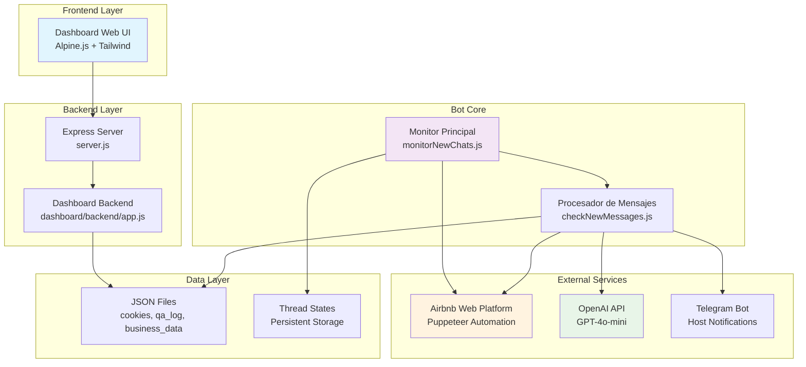
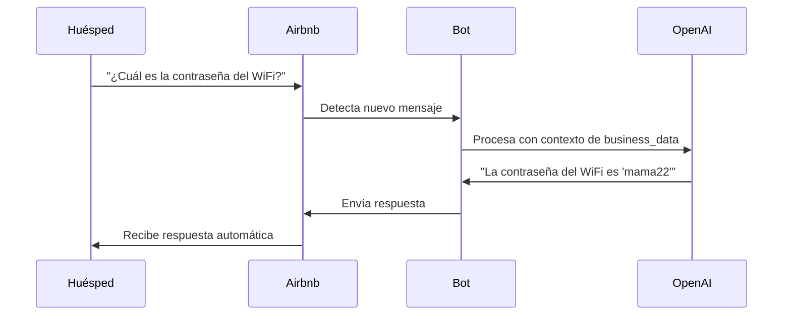
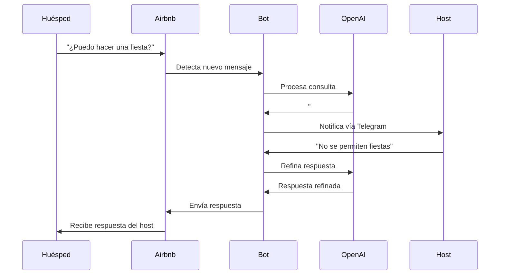
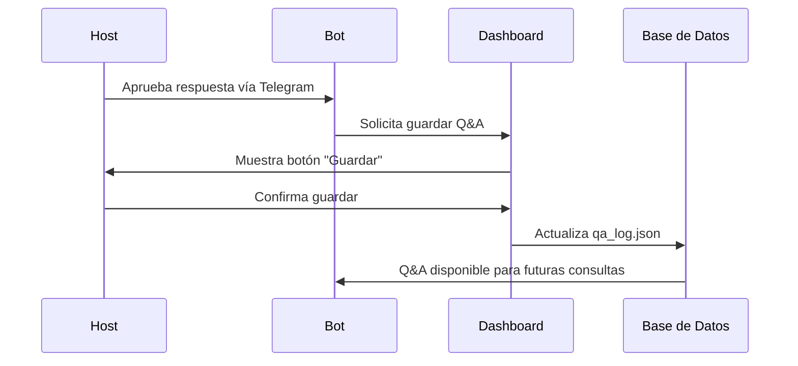
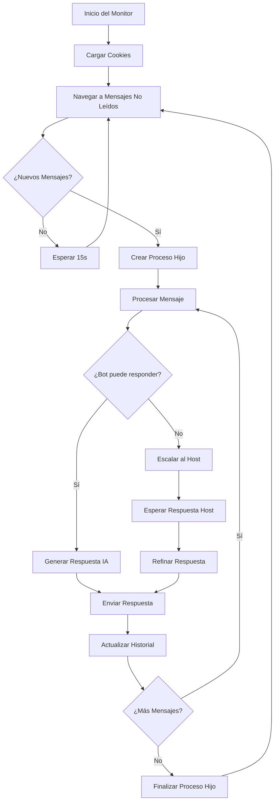
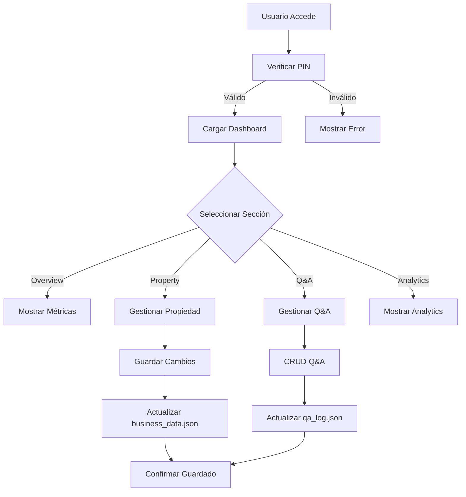

# 🤖 AirbnBOT - Documentación Completa del Proyecto

## 📋 Tabla de Contenidos

1. [Descripción General](#-descripción-general)
2. [Arquitectura Técnica](#️-arquitectura-técnica)
3. [Componentes del Sistema](#-componentes-del-sistema)
4. [Funcionalidades del Bot](#-funcionalidades-del-bot)
5. [Dashboard de Administración](#-dashboard-de-administración)
6. [Stack Tecnológico](#-stack-tecnológico)
7. [Estructura de Datos](#-estructura-de-datos)
8. [Scripts y Automatización](#-scripts-y-automatización)
9. [Configuración y Despliegue](#-configuración-y-despliegue)
10. [Seguridad](#-seguridad)
11. [Métricas y Monitoreo](#-métricas-y-monitoreo)
12. [Casos de Uso](#-casos-de-uso)
13. [Flujos de Trabajo](#-flujos-de-trabajo)
14. [Mantenimiento](#-mantenimiento)

---

## 🎯 Descripción General

**AirbnBOT** es un sistema automatizado de comunicación con huéspedes de Airbnb que combina inteligencia artificial, automatización web y un dashboard administrativo completo. El proyecto está diseñado para:

- **Automatizar respuestas** a consultas frecuentes de huéspedes
- **Escalar consultas complejas** al host cuando es necesario
- **Aprender continuamente** de las interacciones
- **Proporcionar métricas** y análisis de rendimiento
- **Gestionar información** de la propiedad de forma centralizada

### 🏆 Características Principales

- ✅ **Respuestas automáticas inteligentes** usando GPT-4o-mini
- ✅ **Monitoreo en tiempo real** de mensajes de Airbnb
- ✅ **Escalación automática** al host vía Telegram
- ✅ **Dashboard web moderno** para administración
- ✅ **Base de conocimiento** auto-actualizable
- ✅ **Arquitectura híbrida** escalable
- ✅ **Métricas y analytics** detallados

---

## 🏗️ Arquitectura Técnica

### Diagrama de Arquitectura General



### Arquitectura Híbrida del Bot

El sistema utiliza una **arquitectura híbrida** con:

- **Proceso Padre** ([`monitorNewChats.js`](scripts/monitorNewChats.js)): Monitorea nuevos chats
- **Procesos Hijo** ([`checkNewMessages.js`](scripts/checkNewMessages.js)): Procesan mensajes individuales
- **Comunicación IPC**: Intercambio de datos entre procesos
- **Estado Persistente**: Almacenamiento en archivos JSON

---

## 🧩 Componentes del Sistema

### 1. **Servidor Principal** ([`server.js`](server.js))
- Punto de entrada de la aplicación
- Sirve el dashboard web
- Maneja rutas de salud y redirecciones

### 2. **Dashboard Backend** ([`dashboard/backend/app.js`](dashboard/backend/app.js))
- API REST para el dashboard
- Middleware de seguridad (Helmet, CORS, Rate Limiting)
- Rutas para autenticación, propiedades, Q&A y analytics

### 3. **Dashboard Frontend** ([`dashboard/frontend/index.html`](dashboard/frontend/index.html))
- Interfaz web moderna con Alpine.js
- Gestión de propiedades y Q&A
- Visualización de métricas y analytics

### 4. **Monitor de Chats** ([`scripts/monitorNewChats.js`](scripts/monitorNewChats.js))
- Proceso principal del bot
- Detecta nuevos mensajes no leídos
- Gestiona procesos hijo para cada conversación

### 5. **Procesador de Mensajes** ([`scripts/checkNewMessages.js`](scripts/checkNewMessages.js))
- Procesa mensajes individuales
- Interactúa con OpenAI para generar respuestas
- Maneja escalaciones al host

---

## 🤖 Funcionalidades del Bot

### Monitoreo Inteligente

```javascript
// Configuración del monitoreo
const CHECK_INTERVAL = 15000; // 15 segundos
const MAX_IDLE_TIME = 5 * 60 * 1000; // 5 minutos
const AIRBNB_UNREAD_MESSAGES_FILTER_URL = 'https://www.airbnb.com.co/guest/messages?unread=1';
```

**Características:**
- ✅ Escaneo automático cada 15 segundos
- ✅ Detección de mensajes no leídos
- ✅ Gestión de múltiples conversaciones simultáneas
- ✅ Cleanup automático de conversaciones inactivas

### Procesamiento de Mensajes

**Detección de Origen:**
```javascript
// Colores para identificar mensajes
const HOST_MESSAGE_COLOR_HEX = '#3f3f3f';
const GUEST_MESSAGE_COLOR_HEX = '#f7f7f7';
```

**Flujo de Procesamiento:**
1. **Extracción**: Obtiene mensajes del DOM de Airbnb
2. **Clasificación**: Distingue entre mensajes del bot y del huésped
3. **Filtrado**: Evita procesar mensajes duplicados
4. **Contexto**: Mantiene historial de conversación

### Inteligencia Artificial

**Configuración OpenAI:**
```javascript
const openai = new OpenAI({ apiKey: process.env.OPENAI_API_KEY });

// Parámetros del modelo
model: 'gpt-4o-mini',
temperature: 0.20,
max_tokens: 370
```

**Sistema de Escalación:**
- Usa la señal `##ASK_HOST##` cuando no puede responder
- Notifica al host vía Telegram
- Refina respuestas del host antes de enviarlas

### Gestión de Estado

**Thread States** ([`data/thread_states.json`](data/thread_states.json)):
```json
{
  "threadId": {
    "pendingHostRequests": [
      {
        "id": "req_1234567890_abc123",
        "guestMessage": "¿Permiten mascotas?",
        "guestName": "Juan",
        "timestamp": "2025-05-29T16:00:00.000Z",
        "status": "waiting"
      }
    ]
  }
}
```

---

## 📊 Dashboard de Administración

### Características de la Interfaz

- **🎨 Diseño Moderno**: Tailwind CSS con efectos glass
- **📱 Responsive**: Adaptable a móviles y tablets
- **⚡ Reactivo**: Alpine.js para interactividad
- **🔒 Seguro**: Autenticación por PIN

### Secciones Principales

#### 1. **📈 Overview**
```html
<!-- Métricas en tiempo real -->
<div class="grid grid-cols-1 md:grid-cols-2 lg:grid-cols-4 gap-6">
  <div class="bg-white rounded-xl shadow-sm p-6">
    <p class="text-sm text-gray-500">Respuestas Hoy</p>
    <p class="text-2xl font-bold text-gray-800">24</p>
  </div>
  <!-- Más tarjetas de métricas -->
</div>
```

#### 2. **🏠 Property Management**
- Información básica de la propiedad
- Configuración de amenidades
- Campos personalizables
- Datos de contacto y acceso

#### 3. **❓ Q&A Management**
- Banco de preguntas y respuestas
- Categorización automática
- Búsqueda y filtrado avanzado
- Edición en línea

#### 4. **🔗 Airbnb Integration**
- Estado de conexión en tiempo real
- Login automatizado
- Gestión de cookies
- Monitoreo de sesión

#### 5. **📊 Analytics**
- Gráficos de rendimiento
- Preguntas más frecuentes
- Tendencias de uso
- Métricas de efectividad

---

## 🛠️ Stack Tecnológico

### Backend Technologies

| Tecnología | Versión | Propósito |
|------------|---------|-----------|
| **Node.js** | >=14.0.0 | Runtime de JavaScript |
| **Express.js** | ^4.21.2 | Framework web |
| **Puppeteer** | ^24.9.0 | Automatización web |
| **OpenAI** | ^4.103.0 | Procesamiento de lenguaje natural |
| **Telegram Bot API** | ^0.66.0 | Notificaciones |

### Frontend Technologies

| Tecnología | Propósito |
|------------|-----------|
| **Alpine.js** | Reactividad y estado |
| **Tailwind CSS** | Estilos y diseño |
| **Chart.js** | Visualizaciones |
| **Lucide Icons** | Iconografía |

### Security & Middleware

```javascript
// Configuración de seguridad
app.use(helmet({
    contentSecurityPolicy: {
        directives: {
            defaultSrc: ["'self'"],
            styleSrc: ["'self'", "'unsafe-inline'", "https://cdn.tailwindcss.com"],
            scriptSrc: ["'self'", "'unsafe-inline'", "'unsafe-eval'"]
        }
    }
}));

// Rate limiting
const limiter = rateLimit({
    windowMs: 15 * 60 * 1000, // 15 minutos
    max: 100 // máximo 100 requests por ventana
});
```

---

## 📁 Estructura de Datos

### Business Data ([`data/business_data.json`](data/business_data.json))

```json
{
  "name": "Apartamento Moderno en Laureles",
  "location": "Laureles, Medellín, Colombia",
  "capacity": "10 personas",
  "maxGuests": 4,
  "bedrooms": 2,
  "bathrooms": 1.5,
  "wifi_username": "papa",
  "wifi_password": "mama22",
  "check_in_time": "después de las 3 p.m.",
  "check_out_time": "antes de las 11 a.m.",
  "amenities": {
    "wifi": { "enabled": true },
    "ac": { "enabled": true, "location": "solo en el cuarto principal" },
    "kitchen": { "enabled": true },
    "parking": { "enabled": false }
  },
  "floor_number": "tercer piso",
  "stairs_only": true,
  "metro_station_nearest": "Floresta",
  "metro_station_nearest_walk_minutes": "15 minutos"
}
```

### Q&A Log ([`data/qa_log.json`](data/qa_log.json))

```json
[
  {
    "guest_question": "¿Cuál es la contraseña del WiFi?",
    "bot_answer": "La contraseña del WiFi es 'mama22' y la red se llama 'papa'.",
    "source": "host_approved",
    "timestamp": "2025-05-29T16:00:00.000Z",
    "category": "amenities",
    "usage_count": 15
  }
]
```

### Cookies Storage ([`data/cookies.json`](data/cookies.json))

```json
[
  {
    "name": "session_id",
    "value": "abc123...",
    "domain": ".airbnb.com.co",
    "path": "/",
    "expires": 1735689600,
    "httpOnly": true,
    "secure": true
  }
]
```

---

## 🔧 Scripts y Automatización

### Comandos Principales

```bash
# Desarrollo
npm run dev          # Dashboard en modo desarrollo
npm run bot:dev      # Bot en modo desarrollo
npm run all:dev      # Ambos servicios en desarrollo

# Producción
npm start            # Dashboard
npm run bot          # Bot
npm run all          # Ambos servicios

# Utilidades
npm run setup        # Configuración inicial
```

### Scripts Disponibles

#### 1. **Monitor Principal** ([`scripts/monitorNewChats.js`](scripts/monitorNewChats.js))
```bash
node scripts/monitorNewChats.js
```
- Proceso principal del bot
- Monitorea mensajes no leídos
- Gestiona procesos hijo

#### 2. **Procesador de Mensajes** ([`scripts/checkNewMessages.js`](scripts/checkNewMessages.js))
```bash
node scripts/checkNewMessages.js <chat_url> [initial_history]
```
- Procesa mensajes individuales
- Ejecutado como proceso hijo

#### 3. **Login Automatizado** ([`scripts/loginAndSaveCookies.js`](scripts/loginAndSaveCookies.js))
```bash
node scripts/loginAndSaveCookies.js
```
- Automatiza el login en Airbnb
- Guarda cookies para sesiones futuras

#### 4. **Configuración** ([`scripts/setups.js`](scripts/setups.js))
```bash
node scripts/setup.js
```
- Configuración inicial del proyecto
- Creación de archivos de datos

---

## ⚙️ Configuración y Despliegue

### Variables de Entorno ([`.env`](.env))

```bash
# OpenAI Configuration
OPENAI_API_KEY=sk-...

# Telegram Configuration
TELEGRAM_TOKEN=123456789:ABC...
TELEGRAM_CHAT_ID=123456789

# Airbnb Credentials
AIRBNB_EMAIL=tu-email@ejemplo.com
AIRBNB_PASSWORD=tu-contraseña

# Server Configuration
PORT=3000
NODE_ENV=production

# Dashboard Authentication
DASHBOARD_PIN=1234
```

### Instalación

```bash
# 1. Clonar el repositorio
git clone https://github.com/Eam145vc/Yuca.git
cd airbnBOT

# 2. Instalar dependencias
npm install

# 3. Configurar variables de entorno
cp .env.example .env
# Editar .env con tus credenciales

# 4. Ejecutar configuración inicial
npm run setup

# 5. Iniciar servicios
npm run all
```

### Estructura de Directorios

```
airbnBOT/
├── dashboard/
│   ├── backend/
│   │   ├── app.js
│   │   ├── middleware/
│   │   └── routes/
│   └── frontend/
│       ├── index.html
│       └── js/
├── data/
│   ├── business_data.json
│   ├── qa_log.json
│   ├── cookies.json
│   └── thread_states.json
├── scripts/
│   ├── monitorNewChats.js
│   ├── checkNewMessages.js
│   ├── loginAndSaveCookies.js
│   └── setups.js
├── logs/
├── public/
├── server.js
├── package.json
└── README.md
```

---

## 🔒 Seguridad

### Medidas de Seguridad Implementadas

#### 1. **Autenticación**
```javascript
// Middleware de autenticación
const authMiddleware = (req, res, next) => {
    const pin = req.headers['x-dashboard-pin'];
    if (pin !== process.env.DASHBOARD_PIN) {
        return res.status(401).json({ error: 'Unauthorized' });
    }
    next();
};
```

#### 2. **Rate Limiting**
```javascript
const limiter = rateLimit({
    windowMs: 15 * 60 * 1000, // 15 minutos
    max: 100, // máximo 100 requests
    message: 'Too many requests'
});
```

#### 3. **Headers de Seguridad**
```javascript
app.use(helmet({
    contentSecurityPolicy: true,
    crossOriginEmbedderPolicy: false
}));
```

#### 4. **Validación de Datos**
```javascript
const Joi = require('joi');

const propertySchema = Joi.object({
    name: Joi.string().required(),
    type: Joi.string().valid('apartment', 'house', 'studio'),
    maxGuests: Joi.number().min(1).max(20)
});
```

### Mejores Prácticas

- ✅ **Variables de entorno** para datos sensibles
- ✅ **Validación de entrada** en todas las rutas
- ✅ **Rate limiting** para prevenir abuso
- ✅ **Headers de seguridad** con Helmet
- ✅ **Autenticación** para acceso al dashboard
- ✅ **Logs de seguridad** para auditoría

---

## 📈 Métricas y Monitoreo

### Métricas Disponibles

#### 1. **Métricas de Respuesta**
- Número de respuestas automáticas por día
- Tiempo promedio de respuesta
- Tasa de éxito de respuestas automáticas

#### 2. **Métricas de Escalación**
- Número de consultas escaladas al host
- Tiempo de respuesta del host
- Tasa de resolución de escalaciones

#### 3. **Métricas de Q&A**
- Número total de Q&As en la base
- Q&As más utilizadas
- Efectividad de respuestas

#### 4. **Métricas del Sistema**
- Uptime del bot
- Número de conversaciones activas
- Uso de memoria y CPU

### Dashboard de Analytics

```javascript
// Ejemplo de datos de analytics
const analytics = {
    responseRate: 89,
    totalResponses: 247,
    escalations: 23,
    topQuestions: [
        { text: "¿Cuál es la contraseña del WiFi?", count: 45 },
        { text: "¿A qué hora es el check-in?", count: 32 },
        { text: "¿Dónde está la estación de metro?", count: 28 }
    ]
};
```

---

## 🎯 Casos de Uso

### Caso de Uso 1: Respuesta Automática

**Escenario:** Huésped pregunta sobre WiFi



### Caso de Uso 2: Escalación al Host

**Escenario:** Huésped pregunta sobre eventos



### Caso de Uso 3: Aprendizaje del Sistema

**Escenario:** Host aprueba nueva respuesta



---

## 🔄 Flujos de Trabajo

### Flujo Principal del Bot



### Flujo del Dashboard



---

## 🔧 Mantenimiento

### Tareas de Mantenimiento Regulares

#### Diarias
- ✅ Verificar logs de errores
- ✅ Monitorear métricas de respuesta
- ✅ Revisar escalaciones pendientes

#### Semanales
- ✅ Limpiar logs antiguos
- ✅ Revisar y actualizar Q&As
- ✅ Verificar estado de cookies de Airbnb

#### Mensuales
- ✅ Actualizar dependencias
- ✅ Revisar métricas de rendimiento
- ✅ Backup de datos importantes

### Troubleshooting Común

#### Problema: Bot no responde
```bash
# Verificar procesos activos
ps aux | grep node

# Revisar logs
tail -f logs/bot.log

# Reiniciar bot
npm run bot
```

#### Problema: Login de Airbnb falla
```bash
# Limpiar cookies
rm data/cookies.json

# Ejecutar login manual
node scripts/loginAndSaveCookies.js
```

#### Problema: Dashboard no carga
```bash
# Verificar puerto
netstat -tulpn | grep :3000

# Reiniciar servidor
npm run dashboard
```

### Logs y Debugging

```javascript
// Configuración de logs
const morgan = require('morgan');
app.use(morgan('combined'));

// Logs personalizados
console.log(`[T:${threadId}] 📨 Processing ${newMessages.length} new message(s).`);
console.error(`[T:${threadId}] ❌ Error: ${error.message}`);
```

---

## 📞 Soporte y Contacto

### Información del Proyecto

- **Nombre**: AirbnBOT
- **Versión**: 2.0.0
- **Repositorio**: https://github.com/Eam145vc/Yuca.git
- **Licencia**: ISC

### Estructura del Equipo

- **Desarrollo**: Sistema automatizado
- **Mantenimiento**: Host/Administrador
- **Soporte**: Documentación y logs

### Recursos Adicionales

- 📚 **Documentación de APIs**:
  - [OpenAI API](https://platform.openai.com/docs)
  - [Telegram Bot API](https://core.telegram.org/bots/api)
  - [Puppeteer Docs](https://pptr.dev/)

- 🛠️ **Herramientas de Desarrollo**:
  - [Node.js](https://nodejs.org/)
  - [Express.js](https://expressjs.com/)
  - [Alpine.js](https://alpinejs.dev/)
  - [Tailwind CSS](https://tailwindcss.com/)

---

## 🚀 Roadmap y Mejoras Futuras

### Versión 2.1 (Próxima)
- [ ] Integración con base de datos SQL
- [ ] Sistema de usuarios múltiples
- [ ] API REST completa
- [ ] Notificaciones push

### Versión 2.2 (Futuro)
- [ ] Integración con múltiples plataformas
- [ ] Machine Learning avanzado
- [ ] Dashboard móvil nativo
- [ ] Sistema de reportes avanzado

### Versión 3.0 (Visión)
- [ ] Arquitectura de microservicios
- [ ] Escalabilidad horizontal
- [ ] IA conversacional avanzada
- [ ] Integración con IoT

---

*Documentación generada el 29 de mayo de 2025*
*AirbnBOT v2.0.0 - Sistema Automatizado de Comunicación con Huéspedes*